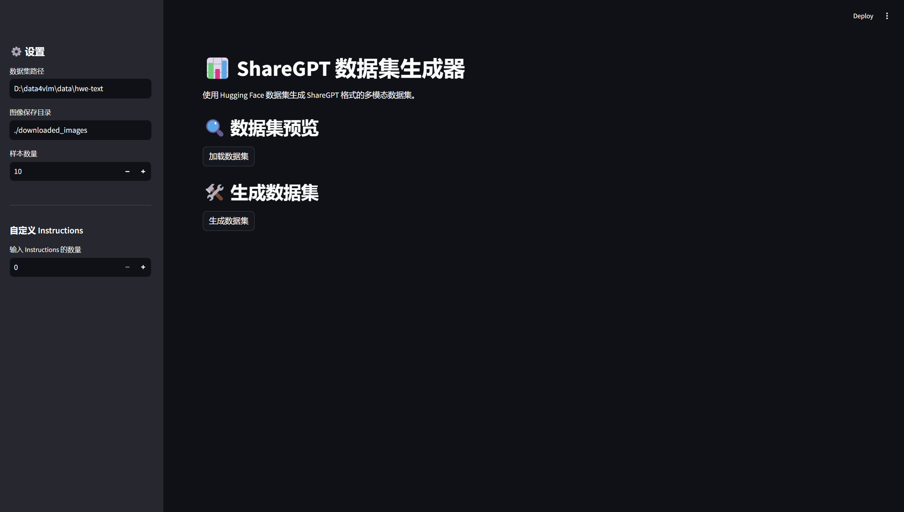

# ShareGPT 数据集生成器

📊 一个基于Streamlit的Web应用，用于生成ShareGPT格式的多模态数据集

## 功能特性

- 🖼️ 从Hugging Face数据集加载多模态数据（图像+文本）
- 📝 支持自定义Instructions
- 🔄 自动转换为ShareGPT格式
- 💾 生成JSON格式数据集文件
- 📥 提供数据集下载功能
- 🎨 内置图像预览功能

## 使用说明

1. 在侧边栏设置数据集路径和图像保存目录
2. 设置要处理的样本数量
3. 可添加自定义Instructions（可选）
4. 点击"加载数据集"预览数据
5. 点击"生成数据集"创建ShareGPT格式数据集

## 安装依赖
1. 使用conda：
```bash
conda create -n venv python=3.10
pip install -r requirements.txt
```
2. 使用uv(推荐)：
```bash
uv venv
uv sync
```

## 运行应用
1. clone项目到本地,创建data文件夹用于存放数据集
```bash
git clone https://github.com/Argobell/data4vlmsft.git
mkdir data
```
2. 从Hugging Face或者Modelscope下载数据集放入data目录(也可以自定义数据集)
3. 运行以下命令启动应用
```bash
streamlit run app.py
```

## 项目结构

```
.
├── app.py                # Streamlit Web应用入口
├── src/
│   └── dataset_builder.py # 数据集构建核心逻辑
└── utils/                # 工具函数
    ├── convert2sharegpt.py # ShareGPT格式转换
    └── random_instruction.py # 随机Instructions生成
```

## 示例截图
    

